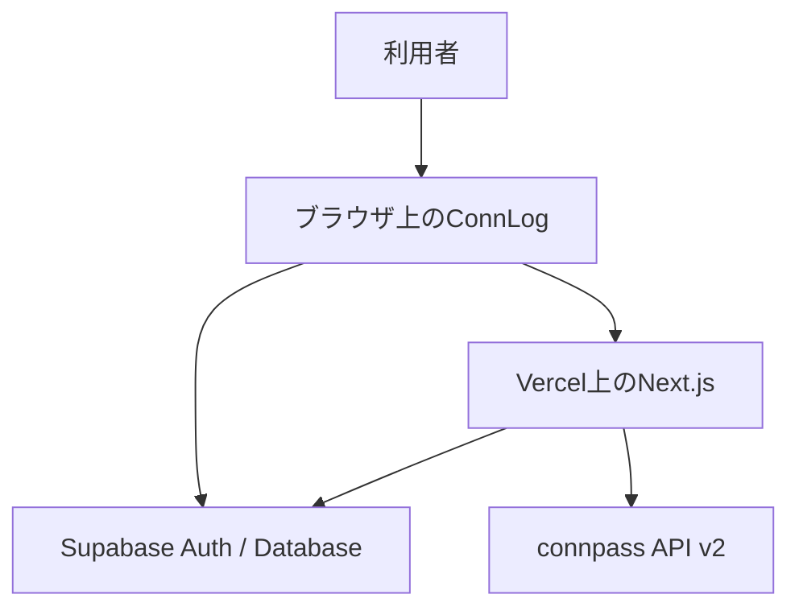
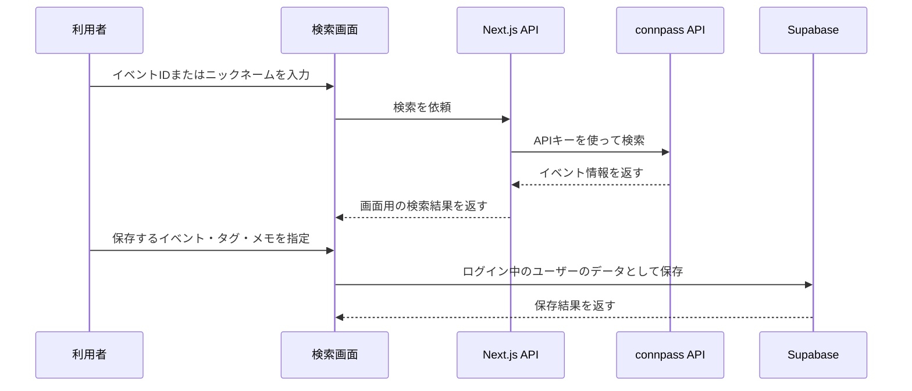
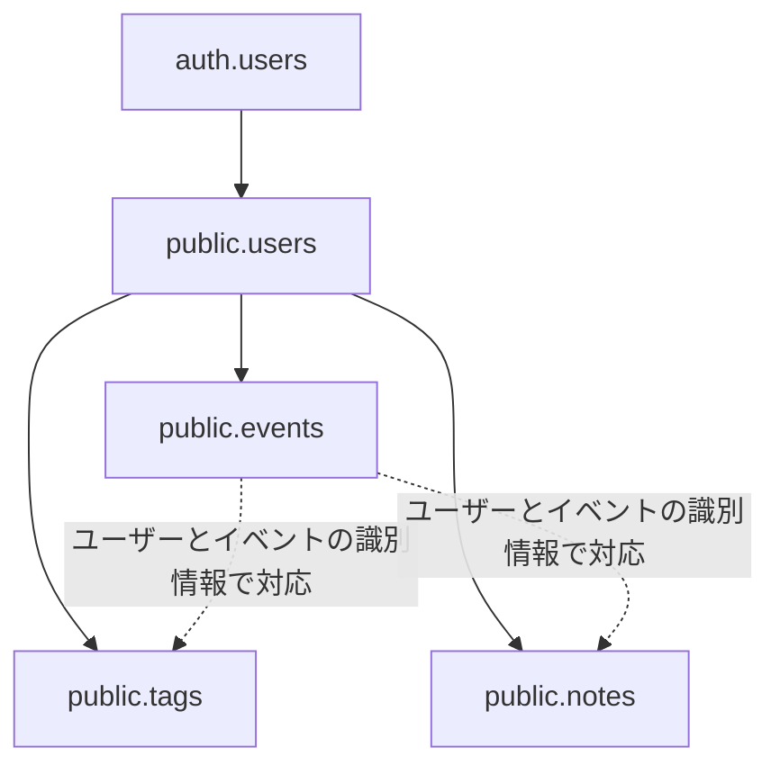

# ConnLog システム全体像

最終更新：2026年8月12日
対象：ConnLog MVPの現在の実装

## この文書の目的

この文書は、ConnLogの画面、API、データベース、認証、外部サービスがどのようにつながっているかを、リポジトリ全体を読み込まなくても把握できるようにするための設計概要である。

主な想定読者は次のとおり。

- 開発を再開するときの自分
- コードレビューや技術相談を依頼する相手
- ConnLogの構成を初めて確認する開発者

この文書には、環境変数の値、APIキー、Cookie、トークン、個人情報などの秘密情報は記載しない。また、個別のセキュリティ検証結果や未修正事項の詳細は、`docs/review`配下の文書で管理する。

実装とこの文書に差異がある場合は、実装と現在のSupabase設定を正とする。

## 1. ConnLogとは

ConnLogは、connpassのイベント参加履歴を保存し、タグやメモを付けて学習履歴として振り返るためのWebアプリケーションである。

connpass上のイベント情報をそのまま一覧表示するだけではなく、利用者自身の記録としてSupabaseへ保存する。保存後は、イベント履歴の確認、タグ・メモの編集、参加傾向の集計、プロフィール管理などをConnLog上で行う。

主な技術構成は次のとおり。

| 分類 | 使用技術・サービス | 主な役割 |
| --- | --- | --- |
| フロントエンド | Next.js 15、React、TypeScript、Tailwind CSS | 画面表示と利用者操作 |
| サーバー処理 | Next.js App Router / Route Handler | 認証確認、外部API呼び出し、DB処理 |
| 認証 | Supabase Auth | ユーザー登録、ログイン、セッション管理 |
| データベース | Supabase PostgreSQL | イベント、タグ、メモ、プロフィールの保存 |
| 認可 | Supabase Row Level Security（RLS） | ユーザーごとのデータ分離 |
| 外部データ | connpass API v2 | イベント情報と参加履歴の取得 |
| ホスティング | Vercel | Next.jsアプリの配信とサーバー処理の実行 |

## 2. 利用者ができること

ConnLogのMVPでは、認証済みの利用者が主に次の操作を行える。

- connpassイベントIDからイベントを検索する
- connpassのニックネームから参加イベントを検索する
- イベントを自分の履歴へ保存する
- 保存時または保存後にタグとメモを登録・編集する
- 自分のイベント履歴を確認する
- ダッシュボードで参加数やタグの傾向を確認する
- スキル分析画面で学習分野を振り返る
- 表示名と自己紹介を編集する
- パスワードを変更する
- ログアウトする
- 自分のアカウントと関連データを削除する

イベント、タグ、メモ、プロフィールはログイン中のユーザーに紐づく。別ユーザーのデータを通常の画面操作で共有・編集する機能はない。

## 3. システム全体の構成

ConnLogは、ブラウザ、Vercel上のNext.js、Supabase、connpass API v2で構成される。

役割分担は次のとおり。

- ブラウザは画面表示、入力、Supabase Authの認証操作、一部のユーザー所有データの読み書きを担当する
- Next.jsのサーバー処理は、ログイン状態の確認、connpass APIの代理呼び出し、集計、更新、削除などを担当する
- Supabase Authはユーザーの本人確認とセッションを管理する
- Supabase PostgreSQLはConnLog固有のデータを保存する
- RLSは、ブラウザまたは通常のサーバークライアントからDBへアクセスするときに、本人の行だけを扱えるよう制限する
- connpass API v2は検索元となるイベント情報を提供する
- Vercelは画面とAPIを配信し、Preview環境とProduction環境を管理する

## 4. 主要画面とURL

### 通常画面

| URL | 主な役割 | 主な実装場所 |
| --- | --- | --- |
| `/`               | 認証済みなら`/dashboard`、未認証なら`/login`へリダイレクト | `src/app/page.tsx`                 |
| `/login` | メールアドレスとパスワードによるログイン | `src/app/login/page.tsx` |
| `/signup` | 公開登録が有効な場合の新規ユーザー登録 | `src/app/signup/page.tsx` |
| `/search` | connpassイベントの検索と履歴への保存 | `src/app/search/page.tsx` |
| `/events` | 保存済みイベント、タグ、メモの確認・編集・削除 | `src/app/events/page.tsx` |
| `/dashboard` | 参加履歴とタグの集計表示 | `src/app/dashboard/page.tsx` |
| `/skills` | タグをもとにしたスキル傾向の表示 | `src/app/skills/page.tsx` |
| `/profile` | 表示名、自己紹介、パスワード、退会操作 | `src/app/profile/page.tsx` |
| `/set-password` | 招待されたユーザーの初回パスワード設定 | `src/app/set-password/page.tsx` |
| `/privacy-policy` | プライバシーポリシー | `src/app/privacy-policy/page.tsx` |
| `/terms` | 利用規約 | `src/app/terms/page.tsx` |

### 認証用ルート

| URL | 主な役割 |
| --- | --- |
| `/auth/confirm`  | 招待メールの`token_hash`を確認し、既定で`/set-password`へ進める |
| `/auth/callback` | 認証コードをセッションへ交換し、指定先へ戻す |

これらは通常の機能画面ではなく、Supabase AuthとConnLogをつなぐためのルートである。

## 5. 画面からAPI・DBまでの主な流れ

### 5.1 イベントを検索して保存する流れ

検索では、ブラウザからconnpass APIを直接呼ばない。Next.jsのAPIが認証状態を確認し、サーバー側に保持した`CONNPASS_API_KEY`を使ってconnpass API v2を呼び出す。

保存処理では、`src/lib/saveEventWithTagsAndNote.ts`がブラウザ用Supabaseクライアントを利用する。DB側のRLSにより、ログイン中のユーザーIDに一致するデータだけを扱う。

### 5.2 保存済みイベントを表示する流れ

`/events`は、ログイン中のユーザーに紐づくイベント、タグ、メモを取得し、履歴として表示する。取得結果が空の場合は空状態UIを表示し、別ユーザー用のデモデータやフォールバックデータは表示しない。

### 5.3 ダッシュボードとスキル分析の流れ

`/dashboard`は`POST /api/dashboard-data`を呼び出す。Route Handlerはログイン中のユーザーを確認し、そのユーザーのイベント、タグ、メモを取得して画面用に集計する。

`/skills`は、保存済みタグをもとに、利用者がどの分野のイベントへ参加しているかを可視化する。

### 5.4 タグ・メモを更新する流れ

`/events`の編集操作は`PUT /api/events/update`へ送られる。Route Handlerは認証済みユーザーを確認したうえで、そのユーザーに紐づくタグとメモを更新する。DB側でもRLSが適用される。

### 5.5 イベントを削除する流れ

`/events`の削除操作は`DELETE /api/events/delete`へ送られる。Route Handlerは、ログイン中のユーザーIDと対象イベントを組み合わせ、関連するメモ、タグ、イベントを削除する。

### 5.6 プロフィールを表示・更新する流れ

`GET /api/profile`は、ログイン中のユーザーの表示名と自己紹介を取得する。`PUT /api/profile`は、そのユーザーのプロフィールを作成または更新する。

### 5.7 アカウントを削除する流れ

`DELETE /api/account/delete`は、最初に通常のSupabaseクライアントで本人の認証状態を確認する。その後、サーバー側だけで利用できる管理権限を使い、本人に紐づくConnLogデータとSupabase Authのユーザーを削除する。

### 5.8 主要API一覧

| API | メソッド | 主な役割 |
| --- | --- | --- |
| `/api/search-event` | `GET` | connpassイベントIDによる検索 |
| `/api/search-user` | `GET` | connpassニックネームによる参加イベント検索 |
| `/api/dashboard-data` | `POST` | 本人のイベント、タグ、メモの取得と集計 |
| `/api/events/update` | `PUT` | 本人のタグとメモの更新 |
| `/api/events/delete` | `DELETE` | 本人のイベントと関連データの削除 |
| `/api/profile` | `GET` | 本人のプロフィール取得 |
| `/api/profile` | `PUT` | 本人のプロフィール作成・更新 |
| `/api/account/delete` | `DELETE` | 本人の関連データと認証アカウントの削除 |

## 6. データベース構成

ConnLogでは、Supabase Authが管理する認証ユーザーと、`public`スキーマにあるアプリ用テーブルを組み合わせている。

| テーブル | 主な役割 | ユーザーとの関係 |
| --- | --- | --- |
| `auth.users` | Supabase Authが管理する認証情報 | 認証ユーザーの基準 |
| `public.users`  | 表示名、自己紹介などのプロフィール | `auth.users`のIDに対応 |
| `public.events` | 保存したconnpassイベント | `user_id`で所有者を識別 |
| `public.tags` | イベントへ付けたタグ | `user_id`で所有者を識別 |
| `public.notes` | イベントへ付けたメモ | `user_id`で所有者を識別 |

以下はアプリ上の所有関係と対応関係を示す概念図である。矢印は、すべてがDBの外部キー制約であることを示すものではない。

### 所有者の識別

ユーザー所有データでは、`user_id`を現在の所有者判定の基準とする。リポジトリ内のSQLでは、`events`、`tags`、`notes`のRLS Policyは、`auth.uid()`と行の`user_id`が一致することを条件としている。また、2026年8月8日にSupabase SQL Editorで確認した時点でも、3テーブルに同じ条件が設定されていた。

### イベントID

`events.event_id`はconnpass側のイベントIDを表す。ConnLog内部の行IDとは役割が異なるため、コードやAPIを確認するときは混同しない。

### 重複保存の防止

`events`には、同じユーザーが同じconnpassイベントを重複保存しないよう、`user_id`と`event_id`の組み合わせに一意制約がある。

## 7. ログイン・ユーザー登録の流れ

### 7.1 通常ログイン

1. 利用者が`/login`へメールアドレスとパスワードを入力する
2. ブラウザ用SupabaseクライアントがSupabase Authへログインを依頼する
3. 認証に成功するとセッションが作成される
4. 認証済み画面へ移動する

### 7.2 公開ユーザー登録

公開登録が有効な場合、`/signup`からSupabase Authの`signUp`を実行する。Supabaseの設定により、すぐにセッションが作成される場合と、確認メール内のリンクを開いて登録を完了する場合がある。

公開登録の表示可否は`NEXT_PUBLIC_SIGNUP_MODE`で制御する。ただし、画面の表示制御だけに依存せず、認証とデータアクセスはSupabase Auth、サーバー側の認証確認、RLSで保護する。

確認メールのリンク先と経由する認証用ルートは、Supabase Authのメールテンプレートとリダイレクト設定に依存するため、リポジトリだけでは確定できない。

### 7.3 招待されたユーザーの初回設定

1. 管理側からSupabase Authの招待メールを送る
2. 利用者がメール内のリンクを開く
3. メールリンクの形式に応じて、`/auth/confirm`が招待用の`token_hash`を検証するか、`/auth/callback`が認証コードをセッションへ交換する
4. 初回設定の導線から`/set-password`へ進み、パスワードを設定する
5. `supabase.auth.updateUser({ password })`の成功後、ダッシュボードへ移動する

現在の`/auth/confirm`は、確認成功後に既定で`/set-password`へリダイレクトする。`/auth/callback`の遷移先は`next`パラメータに依存する。実際に招待メールがどちらのルートを経由するかは、Supabase Authのメールテンプレートとリダイレクト設定に依存するため、リポジトリだけでは確定できない。

ConnLog内には、別ユーザーへ招待メールを送るための一般利用者向けAPIはない。

### 7.4 プロフィール行の自動作成

Supabase Authにユーザーが作成されると、DBトリガーが`public.handle_new_user()`を実行し、`public.users`へ対応するプロフィール行を作成する。

### 7.5 パスワード変更とログアウト

ログイン後のパスワード変更はSupabase Authの`updateUser`を利用する。ログアウトは`signOut`を実行してセッションを終了する。

### 7.6 Middlewareの役割

Middlewareは、Cookieを介してSupabase Authのセッションを更新する。認証状態に応じた画面遷移は、現在は各ページ側で行う。データアクセスは、APIでのユーザー確認とDBのRLSで制御する。

## 8. セキュリティ上の役割分担

ConnLogは、画面の表示制御だけではなく、複数の層で認証と認可を行う。

| 層 | 主な役割 |
| --- | --- |
| ブラウザ | Supabase Authのセッションを利用し、利用者の操作を送信する |
| Middleware   | Cookieを介してSupabase Authのセッションを更新する                 |
| Next.js API | `auth.getUser()`などで現在のユーザーを確認し、本人のIDをDB条件に使う |
| Supabase RLS | `auth.uid()`と`user_id`を照合し、行単位で別ユーザーのデータを遮断する |
| サーバー限定の管理権限 | RLSを超える必要があるアカウント削除処理だけに限定する |

### ブラウザへ置ける情報と置けない情報

Supabaseのブラウザ用公開設定はクライアントから利用されることを前提としており、安全性はRLSと認証を組み合わせて確保する。

一方、次の情報はブラウザへ渡さず、Next.jsのサーバー側環境で管理する。Vercelへデプロイする場合は、Vercelのサーバー用環境変数として設定する。

- `CONNPASS_API_KEY`
- `SUPABASE_SERVICE_ROLE_KEY`
- その他の秘密鍵、トークン、Cookieの実値

### service role key

`SUPABASE_SERVICE_ROLE_KEY`はRLSを迂回できる強い権限を持つ。そのため、ConnLogではアカウント削除に必要なサーバー側処理へ用途を限定し、ブラウザ側コードからは使用しない。

### RLS

`events`、`tags`、`notes`では、本人の`user_id`に限定するRLS Policyを使用する。API側でユーザーIDを絞り込むことと、DB側でRLSを適用することは、どちらか一方で代用するものではなく、両方を維持する。

## 9. DB関数とトリガー

現在の主要なDB関数は`public.handle_new_user()`である。

この関数は、Supabase Authの`auth.users`へ新しいユーザーが追加されたときに、`on_auth_user_created`トリガーから呼び出される。認証ユーザーのIDとメタデータを使い、`public.users`へプロフィールの初期行を作成する。

`auth.users`と`public.users`は別スキーマにあるため、この処理には`SECURITY DEFINER`が必要となる。関数では`search_path`を固定し、一般の`anon`・`authenticated`ロールが直接実行できないよう権限を制限する。

DB変更に使用したSQLは`docs/db`配下へ記録している。現状では、`supabase/migrations`から自動適用する構成ではないため、リポジトリ内のSQLと実際のSupabase DB状態の両方を確認する必要がある。

## 10. Vercel・Supabase・connpass APIの関係
以下はコードと構成上の役割分担を示す。VercelとSupabaseの管理画面上にある現在の設定値やデプロイ状態は、リポジトリだけでは確認できない。

### Vercel

- Next.jsの画面とAPIを配信する
- Preview環境とProduction環境を分ける
- サーバー専用の環境変数を保持する
- Route HandlerやAPIのRuntime Logsを記録する

### Supabase

- Authでユーザー登録、ログイン、セッションを管理する
- PostgreSQLでプロフィール、イベント、タグ、メモを保存する
- RLSでユーザー間のデータを分離する
- DB関数とトリガーで認証ユーザー作成後の初期処理を行う

### connpass API v2

- イベントIDに対応するイベント情報を返す
- connpassニックネームに対応する参加イベントを返す
- ConnLogからの検索はNext.jsのサーバーAPIを経由する
- ConnLogはconnpass側のデータを変更せず、選択したイベント情報を自分のDBへ保存する

保存済みの履歴、タグ、メモ、集計はSupabaseのデータを基準にする。connpass APIは主に新しくイベントを検索・登録するときの情報源である。

## 11. 主要ファイル案内

| 場所 | 主な役割 |
| --- | --- |
| `src/app/**/page.tsx` | App Routerの各画面 |
| `src/app/api/**/route.ts` | 認証確認、検索、集計、更新、削除を行うRoute Handler |
| `src/app/auth/confirm/route.ts`         | 招待メールのトークン確認と初回パスワード設定への遷移       |
| `src/app/auth/callback/route.ts` | 認証コードからセッションを作成するコールバック |
| `src/lib/supabase/` | ブラウザ用・サーバー用Supabaseクライアントの生成 |
| `src/lib/saveEventWithTagsAndNote.ts` | イベント、タグ、メモの保存処理 |
| `src/lib/fetchUserEvents.ts`            | connpassユーザーの参加イベント取得処理             |
| `src/lib/fetchConnpassEvent.ts` | connpassイベント取得に関する共通処理 |
| `src/components/EventSearchForm.tsx` | イベント検索フォーム |
| `src/components/EventListComponent.tsx` | イベント一覧と編集・削除操作 |
| `src/components/LogoutButton.tsx` | ログアウト操作 |
| `src/components/UserMenuDropdown.tsx` | ユーザーメニュー |
| `middleware.ts`                         | Cookieを介したSupabase Authセッションの更新        |
| `docs/db/` | DB変更用SQLと確認用SQL |
| `docs/review/` | セキュリティ確認の仕様書・報告書 |

現在のリポジトリでは、Supabase Edge Functionsを利用する実装は確認されない。API処理は主にNext.jsのRoute Handlerで実装している。
この一覧は、初めてコードを読むときの入口を示すものであり、すべてのファイルを網羅するものではない。

## 12. 用語集

| 用語 | この文書での意味 |
| --- | --- |
| App Router | `src/app`を基準に画面やルートを構成するNext.jsの仕組み |
| Route Handler | `route.ts`にHTTPメソッドごとのサーバー処理を書く仕組み |
| Supabase Auth | ユーザー登録、ログイン、セッションを管理する認証サービス |
| セッション | ログイン中のユーザーを識別するための状態 |
| PostgreSQL | ConnLogのプロフィールやイベント記録を保存するDB |
| RLS | 行単位で、誰がどのデータを読んだり変更したりできるか制限する仕組み |
| `auth.uid()` | 現在ログイン中のSupabaseユーザーIDを返す関数 |
| anon / authenticated | 未認証または認証済みの通常アクセスに使われるSupabaseのロール |
| service role | RLSを迂回できるサーバー専用の強い権限 |
| DB関数 | PostgreSQL内で実行される処理 |
| トリガー | INSERTなどのDB操作をきっかけに関数を自動実行する仕組み |
| `SECURITY DEFINER` | 関数の所有者権限でDB関数を実行する設定 |
| connpass API v2 | connpassのイベント情報や参加履歴を取得する外部API |

---

この文書はシステム構成の案内を目的とする。実行手順はREADME、DB変更履歴は`docs/db`、セキュリティ監査の手順と結果は`docs/review`を参照する。
